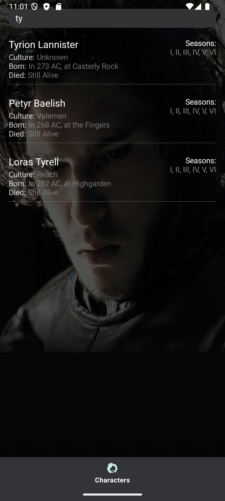
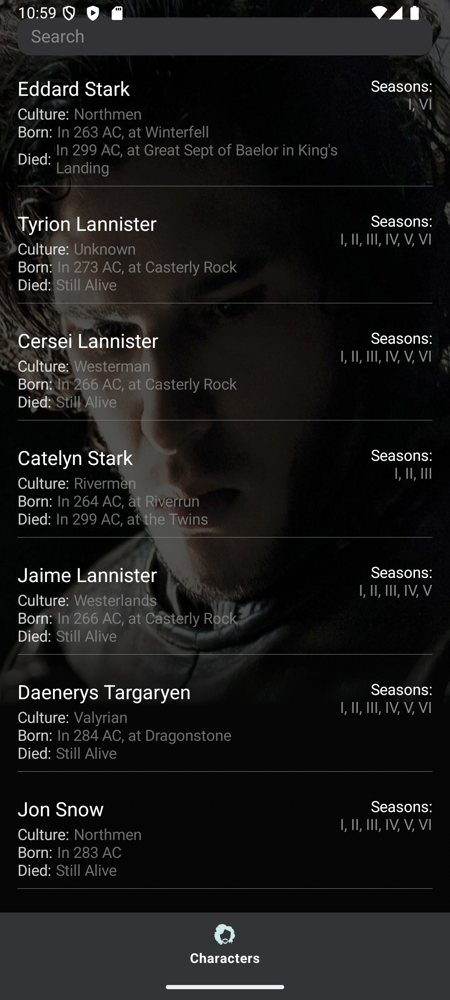

# Game of Thrones Character Explorer App

## 🧪 Tech Test Submission – Android App (Jetpack Compose)

This Android app is a dynamic and responsive interface for browsing Game of Thrones characters using a remote API. Built using modern Android development tools such as **Jetpack Compose**, **Kotlin**, and **Retrofit**, it delivers a smooth, scrollable, and themed UI with enriched character data.

---

## 🛠️ Key Features

- ✅ **Jetpack Compose UI** – Clean, scrollable interface powered by Compose.
- ✅ **API Integration** – Connects to an authenticated API to fetch character data.
- ✅ **Search Functionality** – Real-time character filtering by name.
- ✅ **Image Overlay Background** – Game of Thrones aesthetic using `R.drawable.img_characters`.
- ✅ **Season Display Logic** – Transforms `"Season X"` strings into Roman numerals.

---

## 🧩 Tech Stack

| Layer         | Technology                              |
|--------------|-----------------------------------------|
| UI           | Jetpack Compose                         |
| Architecture | MVVM-like (ViewModel, Repository, Data) |
| Networking   | Retrofit, OkHttp, Gson                  |
| Testing      | JUnit, Mockito, Compose UI Test         |

---

## ✅ What Was Fixed / Improved

| Area                 | Before (Old Version)                                            | After (Improved Version)                                                                 |
|----------------------|-----------------------------------------------------------------|-------------------------------------------------------------------------------------------|
| `ApiCharacter` Model | `aliases: List<Int>` → caused crashes                           | Changed to `List<String>` to match actual API structure                                  |
| API Handling         | No null safety, potential crashes                               | Default/null-safe values and improved deserialization                                    |
| UI/UX                | Missing padding, layout bugs, hard to read                      | Improved spacing, styling, and visual hierarchy                                           |
| Search Bar           | ❌ Missing                                                      | ✅ Real-time search, case-insensitive                                                     |
| Error Handling       | Not implemented                                                 | Network failure messages + retry logic                                                   |
| Code Structure       | Single-file logic                                               | Separated into layers for maintainability (UI, Data, ViewModel, etc.)                   |
| Unit Tests           | None                                                            | Added unit tests for formatting + ViewModel logic                                        |
| UI Tests             | Not present                                                     | Added Compose-based UI tests for filtering and rendering                                |

---

## 🧪 Testing Coverage

### ✅ Unit Tests
- `formatSeasons()` function – Season conversion logic.
- `CharacterViewModel` – API response handling, loading states, and fallback.

### ✅ UI Tests
- Visibility of UI components
- Filtered results validation
- Character detail rendering

---

## 📷 Screenshots

| Search Feature                            | Character List View                        |
|------------------------------------------|--------------------------------------------|
|  |  |

---

## 🌟 Notes

- This version prioritizes **clean architecture**, **UI responsiveness**, and **user-friendly error handling**.
- Fully adheres to modern Android practices with `ViewModel`, `LiveData`, and `Compose`.

## 🚀 Future Features & Improvements
Below are potential enhancements that could further improve the app and elevate the user experience:
### 🌐 1. Pagination & Infinite Scrolling Implement paging support to efficiently load large datasets and improve performance.
### 🔍 2. Advanced Filters Enable users to filter characters by culture, alive/dead status, seasons appeared in, and more.
### 💾 3. Offline Support Cache character data locally to allow viewing without an internet connection.
### 🎨 4. Character Detail Screen Tap on a character to view detailed biography, images, and history.

---

## 🙌 Credits

Created by Emmanuel Obafemi Buraimo as part of a technical assessment for CreateFuture.